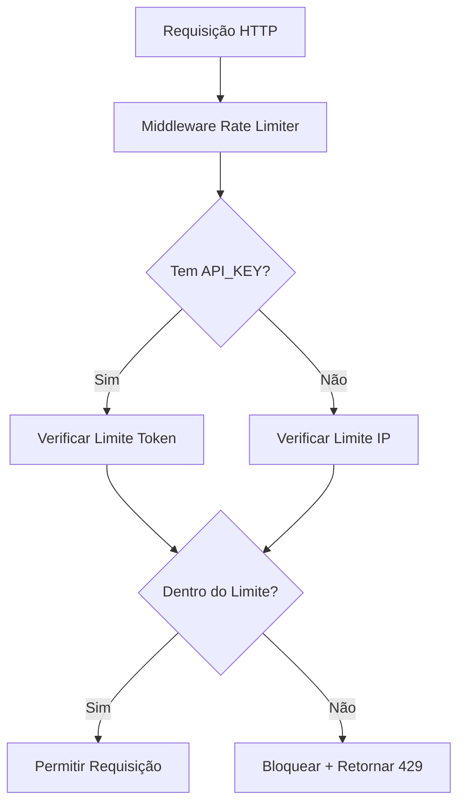

# Rate Limiter GoExpert

Um rate limiter desenvolvido em Go que controla o tráfego de requisições HTTP baseado em endereço IP ou token de acesso, utilizando Redis para armazenamento distribuído.

## 📋 Funcionalidades

- ✅ **Limitação por IP**: Controla requisições por endereço IP
- ✅ **Limitação por Token**: Controla requisições por token de acesso via header `API_KEY`
- ✅ **Priorização de Token**: Configurações de token sobrepõem as de IP
- ✅ **Middleware HTTP**: Integração transparente com servidores web
- ✅ **Storage Redis**: Armazenamento distribuído e de alta performance
- ✅ **Strategy Pattern**: Arquitetura flexível para trocar mecanismos de storage
- ✅ **Bloqueio Temporário**: Bloqueia IPs/tokens que excedem o limite
- ✅ **Configuração via Environment**: Fácil configuração através de variáveis

### Strategy Pattern

O projeto utiliza o **Strategy Pattern** para permitir diferentes implementações de storage:

## 🚀 Como Funciona

### 1. **Fluxo de uma Requisição**



### 2. **Operações no Redis**

```bash
# Primeira requisição por IP
EXISTS block:ip:192.168.1.1     # Verifica se está bloqueado
INCR rate:ip:192.168.1.1        # Incrementa contador (1)
EXPIRE rate:ip:192.168.1.1 1    # Define expiração de 1 segundo

# Requisição que excede limite
INCR rate:ip:192.168.1.1        # Contador = 11 (limite é 10)
SET block:ip:192.168.1.1 "1" EX 300  # Bloqueia por 5 minutos
```

### 3. **Priorização Token vs IP**

- **Com token**: Usa limite de 100 req/s (configurável)
- **Sem token**: Usa limite de 10 req/s por IP (configurável)
- **Token sempre prevalece** sobre configuração de IP

## ⚙️ Configuração

### Variáveis de Ambiente

| Variável | Descrição | Padrão | Obrigatória |
|----------|-----------|--------|-------------|
| `RATE_LIMIT_IP` | Limite de requisições por segundo por IP | 10 | ✅ |
| `RATE_LIMIT_TOKEN` | Limite de requisições por segundo por token | 100 | ✅ |
| `RATE_LIMIT_DURATION_SECONDS` | Tempo de bloqueio em segundos | 300 | ✅ |
| `REDIS_HOST` | Host do Redis | redis | ✅ |
| `REDIS_PORT` | Porta do Redis | 6379 | ✅ |
| `REDIS_PASSWORD` | Senha do Redis | (vazio) | ❌ |
| `REDIS_DB` | Database do Redis | 0 | ✅ |
| `SERVER_PORT` | Porta do servidor HTTP | 8080 | ✅ |

### Arquivo .env

Crie um arquivo `.env` na raiz do projeto:

```env
RATE_LIMIT_IP=10
RATE_LIMIT_TOKEN=100
RATE_LIMIT_DURATION_SECONDS=300
REDIS_HOST=localhost
REDIS_PORT=6379
REDIS_PASSWORD=
REDIS_DB=0
SERVER_PORT=8080
```

## 🐳 Como Executar

### Pré-requisitos

- Docker
- Docker Compose

### 1. Clone o Repositório

```bash
git clone <repository-url>
cd rate_limiter-goexpert
```

### 2. Execute com Docker Compose

```bash
# Construir e executar
docker-compose up --build
```

### 3. Verificar se está Funcionando

```bash
curl http://localhost:8080/
# Resposta esperada: "message: Rate Limiter Service is running"
```

## 🧪 Como Testar

### 1. **Teste Manual Básico**

```bash
# Teste por IP (primeira requisição - deve passar)
curl http://localhost:8080/

# Teste com token (deve passar)
curl -H "API_KEY: meu-token-123" http://localhost:8080/
```

### 2. **Teste de Rate Limiting por IP**

```bash
# Script para testar limite por IP
for i in {1..15}; do
  echo -n "Request $i: "
  status=$(curl -s -w "%{http_code}" -o /dev/null http://localhost:8080/)
  echo "Status: $status"
  
  if [ "$status" = "429" ]; then
    echo "✅ Rate limit ativado na requisição $i"
    break
  fi
  sleep 0.1
done
```

### 3. **Teste com Apache Bench**

```bash
# Instalar Apache Bench (se necessário)
# Ubuntu/Debian: sudo apt-get install apache2-utils
# macOS: brew install httpie (ou usar curl)

# Teste que deve ativar rate limit por IP
ab -n 15 -c 10 http://localhost:8080/

# Teste com token (limite maior)
ab -n 120 -c 20 -H "API_KEY: test-token" http://localhost:8080/
```

### 4. **Teste de Diferentes Cenários**

```bash
#!/bin/bash
echo "=== Teste Completo do Rate Limiter ==="

# Reiniciar ambiente
docker-compose restart
sleep 5

echo "1. Teste por IP (limite: 10 req/s)"
echo "Fazendo 12 requisições rápidas..."
ab -n 12 -c 12 http://localhost:8080/ | grep "Non-2xx responses"

echo -e "\n2. Teste com API_KEY (limite: 100 req/s)"
echo "Fazendo 105 requisições com token..."
ab -n 105 -c 15 -H "API_KEY: test-token" http://localhost:8080/ | grep "Non-2xx responses"

echo -e "\n3. Verificando bloqueio ativo"
response=$(curl -s -w "%{http_code}" -o /dev/null http://localhost:8080/)
echo "Status após limite excedido: $response (esperado: 429)"
```

### 5. **Monitoramento do Redis**

```bash
# Em um terminal separado, monitore as operações do Redis
docker-compose exec redis redis-cli monitor

# Você verá operações como:
# "EXISTS" "block:ip:172.18.0.1"
# "INCR" "rate:ip:172.18.0.1"
# "EXPIRE" "rate:ip:172.18.0.1" "1"
```

## 📊 Resultados Esperados

### ✅ **Comportamento Correto**

| Cenário | Resultado Esperado |
|---------|-------------------|
| 1-10 requisições/s por IP | Status 200 ✅ |
| 11+ requisições/s por IP | Status 429 🚫 |
| 1-100 requisições/s com token | Status 200 ✅ |
| 101+ requisições/s com token | Status 429 🚫 |
| Requisições após bloqueio | Status 429 por 5 minutos 🚫 |
| Requisições após reset | Status 200 ✅ |

### 📋 **Resposta de Rate Limit Excedido**

```json
HTTP/1.1 429 Too Many Requests
Content-Type: application/json

error: you have reached the maximum number of requests or actions allowed within a certain time frame
```